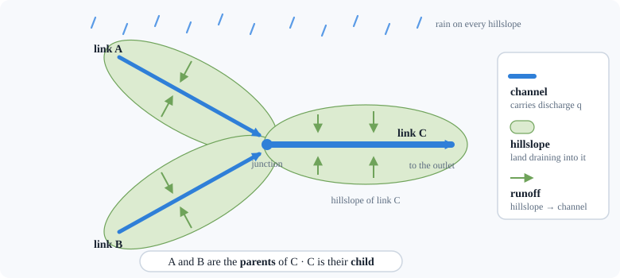
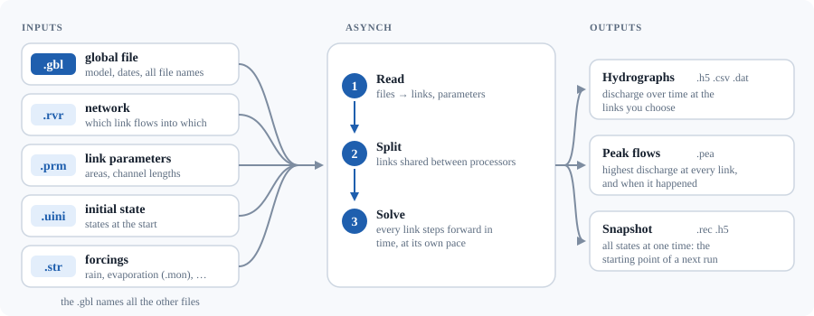

# 0. What ASYNCH is, in plain words

<div class="meta-row"><span class="audience">For everyone</span><span>No programming needed</span><span>10 minutes</span></div>

<p class="lead">ASYNCH computes how much water flows in every stream of a river basin, minute by minute, from the rain
that falls on it. This page explains how it sees a basin, what "solving" means, and what goes in and comes out.</p>

## 0.1 The problem it solves

When it rains on a river basin, water runs over the land and through the soil into small
streams, which join into bigger rivers. ASYNCH computes **how much water flows in every
stream of a basin, minute by minute**. It is built for very large basins: the whole state of
Iowa, for example, with about 400 000 stream segments. The Iowa Flood Center uses it for flood forecasting.

## 0.2 How it sees a river basin: hillslopes and links

ASYNCH cuts the river network into **links**. A link is a stretch of channel between two
junctions, together with the **hillslope**: the land on both sides that drains into that stretch.



* Water on a hillslope is held in a few **storages**: water ponded on the surface, water in the
  top soil, water deeper in the soil. It moves from one storage to the next and finally into the channel.
* Each link receives water from its hillslope and from the links just upstream of it (its
  **parents**), and passes it to the link downstream (its **child**).
* The network is a **tree**: many small branches join into one outlet.

For each link, a handful of numbers describe its situation at a given time: the **states**.
For example: discharge in the channel [m³/s], and depth of water in each storage [m]. Which
states exist, and how they change, is decided by the **model** you choose. ASYNCH contains
dozens of models, identified by a number. Model **254** ("top layer" model) is the main
operational one; model **190** is a simpler one used in the small test example.

## 0.3 What "solving" means

A model says *how fast* each state changes, given the rain and the current states, for
example "the channel loses water in proportion to its discharge". Mathematically, these are
**ordinary differential equations** (ODEs): one small set per link, and the links are coupled
because each one receives the flow of its parents.

ASYNCH starts from an initial state and advances time in small **steps**, computing the new
states after each step. Two ideas make it special:

1. **Every link has its own step size.** A small, steep headwater stream changes fast and needs
   short steps; a big, slow river can take long steps. Most solvers use one step for everybody,
   which wastes a lot of computing time.
2. **It works in parallel.** The network is split between several processors (**MPI
   processes**). Each processor computes its links and passes the flows to the others.



The accuracy of each step is controlled automatically: if the estimated error is larger than
the **tolerance** you set, the step is redone with a smaller step size.

## 0.4 A model run, from start to finish



* **The global file (`.gbl`)** is the only file you give on the command line. It is a text file that
  lists everything else: the model number, the start and end date, the parameters that are the same
  everywhere, where each input file is, what to write out and where, and the solver settings.
* **The network file (`.rvr`)** says which link flows into which.
* **The parameter file (`.prm`)** gives, for each link, its drainage area, channel length and hillslope area.
* **The initial state** gives the states at the start: discharge, soil water, and so on.
* **The forcings** are what drives the model over time: rain (mm/h) and potential evaporation
  (mm/month) are the usual ones.

A run is started from a terminal with one command:

```console
$ mpirun -n 4 asynch clearcreek.gbl
```

"Run `asynch` with the global file `clearcreek.gbl`, split over 4 processors."

:::{tip}
Next: [chapter 1](01_setup.md) installs everything and runs this example; [chapter 2](02_running_the_model.md)
explains how to change a simulation and read its results.
:::

## 0.5 What is in this repository

| Folder | Content | Who needs it |
|---|---|---|
| `examples/` | ready-to-run examples and their reference results | everyone |
| `docs/guide/` | this guide | everyone |
| `docs/*.rst` | the original reference manual: every file format, every model | model users |
| `src/` | the C source code of ASYNCH | people reading or changing the code |
| `tests/` | automatic checks that the results are still right | developers |
| `tools/python/` | Python helpers to read and plot the results | everyone |
| `Dockerfile` | recipe for a ready-made environment (chapter 1, option B) | everyone |

## 0.6 Words you will meet

| Word | Meaning |
|---|---|
| link | a stretch of channel plus the hillslope draining into it |
| state | a quantity the model tracks at each link (discharge, storage, ...) |
| model (number) | the set of equations used; chosen by its number in the `.gbl` |
| forcing | a time series driving the model (rain, evaporation) |
| hydrograph | discharge as a function of time at one link |
| peak flow | the highest discharge reached at a link during the run |
| snapshot | all states of all links at one moment, used to restart |
| step, step size | one advance in time of the solver, and its length (minutes) |
| tolerance | the error the solver accepts per step; smaller is more accurate but slower |
| MPI process | one copy of the program running on one processor; several work together |
| compile / build | translate the C source code into a program the computer can run |
| terminal | the text window where you type commands |
