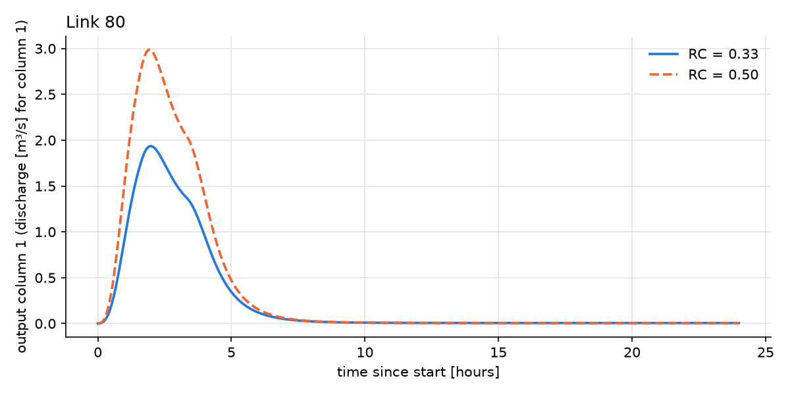

# 2. Running the model

This chapter assumes ASYNCH is installed (chapter 1). Commands are run from the `examples` folder;
`asynch` stands for the program, which is `../build/src/asynch` if you did not run `make install`, and
simply `asynch` inside Docker.

## 2.1 The command

```bash
mpirun -n 4 asynch myrun.gbl
```

| Part | Meaning |
|---|---|
| `mpirun -n 4` | run on 4 processors (MPI processes). 1 is fine for small basins. More than your computer's cores needs `--oversubscribe` and is slower. |
| `asynch` | the program |
| `myrun.gbl` | the global file describing the run. Input and output file names written in it are relative to **the folder you are in**, not to the `.gbl` file |

Options, placed before the `.gbl`: `-m` (or `--more`) prints how long each initialisation step took;
`-v` prints the version; `-h` prints the help; `-d` waits for a key press at start, so a debugger can be attached.

With several processes the results can differ in the last digits from one run to the next (the
asynchronous scheduling, chapter 4). With one process a run is exactly repeatable.

## 2.2 The examples

All in `examples/`. Run times are for one process on a laptop-class computer.

| Global file | Basin, model | What it shows | Time |
|---|---|---|---|
| `test.gbl` | 11 links, model 190 (constant runoff coefficient) | the smallest complete run; one day, rain for 200 minutes | 1 s |
| `test_rkd.gbl` | same | tolerances and solver chosen per link, from `test.rkd` | 1 s |
| `test_2015.gbl` | same | the configuration that produced the reference results `results/test.*`; writes `.dat`/`.rec` into `out_2015/` | 1 s |
| `clearcreek.gbl` | Clear Creek, Iowa: 6 359 links, model 254 (top layer) | the operational model on a real basin; one day | 4 s |
| `clearcreek_2015.gbl` | same | reproduces the reference results `results/clearcreek.*`: 100 hours from 2014-05-01 | 8 s |
| `more/model_*/test*.gbl` | 11 links, models 192, 196, 258, 259 | other models; run them from inside their folder (`cd more/model_192`) | 1 s |

Each example has reference results. Chapter 9 explains how they are checked automatically.

## 2.3 The global file (`.gbl`), block by block

The global file answers a fixed list of questions, **in a fixed order**. Lines starting with `%` are
comments, and blank lines are ignored. This is `examples/test.gbl`, with the meaning of each answer.
The complete reference is `docs/input_output.rst` (section *Global File Structure*).

| In `test.gbl` | Question | Notes |
|---|---|---|
| `190` | which model? | the model number; each needs its own parameters and files (`docs/builtin_models.rst`) |
| `2017-01-01 00:00` and `2017-01-02 00:00` | start and end (UTC) | inside ASYNCH, time is counted in **minutes since the start** |
| `0` | add parameter values to output file names? | 0 = no |
| `3` / `Time` / `LinkID` / `State0` | what to write in the hydrographs | `State0` is the first state (discharge q [m³/s]); `State6` the 7th, etc. |
| `Classic` | format of the peak-flow file | always `Classic` |
| `6  0.33 0.20 -0.1 0.33 0.1 2.2917e-5` | global parameters: how many, then the values | same for all links; meaning depends on the model (for 190: v_r, λ₁, λ₂, RC, v_h, v_g) |
| `30 10 30` | memory buffers | keep these values |
| `0 test.rvr` | network (0 = file) | |
| `0 test.prm` | link parameters (0 = file) | |
| `1 test.uini` | initial state (1 = same for all links) | 0 = `.ini` (per link), 2 = `.rec` snapshot, 4 = `.h5` snapshot |
| `2` then `1 test.str` then `7 evap.mon` + `1398902400 1588291200` | forcings: how many, then one block each | here rain from a `.str` file, and monthly evaporation (`7` = recurring, with the period in unix time) |
| `0` / `0` | dams, reservoirs | 0 = none |
| `5 5.0 outputs.h5` | hydrographs: format, interval [min], file | 1 = `.dat`, 2 = `.csv`, 5 = `.h5` table, 6 = `.h5` arrays |
| `1 test.pea` | peak flows: format, file | 1 = `.pea` |
| `1 test.sav` then `3` | which links: for hydrographs (the ids listed in `test.sav`), for peaks (3 = all links) | |
| `4 60 test.h5` | snapshots | 1 = `.rec` at the end; 3 = `.h5` at the end; 4 = `.h5` every 60 min, named `test_<unix time>.h5` |
| `tmp` | name for temporary files | |
| `.1 10.0 .9` | step-size control (facmin, facmax, safety factor) | keep these values |
| `0` then `2` | tolerances given below (1 = from an `.rkd` file); numerical method | **2 = Dormand–Prince** (recommended); 0 and 1 are lower-order methods; other values are refused |
| 4 lines | tolerances per state: absolute, relative, absolute and relative for interpolated values | smaller = more accurate and slower |

## 2.4 The other input files

The small files of the `test` example can be read by eye:

```
test.rvr (network)           test.prm (link parameters)                test.str (rain)
11          <- number of links 11                                        11          <- number of links

1           <- link id         1                                         1           <- link id
3 2 8 3     <- 3 parents:      0.42674164 0.26215310 0.04694315          3           <- 3 values follow
               links 2, 8, 3   ^upstream  ^channel   ^hillslope          0    40     <- from minute 0: 40 mm/h
9                               area km²   length km  area km²           100  20     <- from minute 100: 20 mm/h
0           <- no parents                                                200   0     <- from minute 200: dry
```

* `evap.mon`: 12 values, the potential evaporation of each month [mm/month].
* `test.sav`: the list of link ids for which hydrographs are written.
* The initial state file (`.uini`) gives one value per state, used for every link:

```
clearcreek.uini
254                               <- model number (ASYNCH warns if it differs from the .gbl)
0.000000                          <- initial time [min]

1e-6 0.0 0.0 0.0 0.0 0.0 1e-6     <- q, s_p, s_t, s_s, s_precip, V_r, q_b: the 7 states of model 254
```

  If it gives fewer values than the model has states, ASYNCH warns and sets the missing ones to 0. For model 254, the last
  three are always recomputed anyway (chapter 5).
* `.rkd` (optional): tolerances and method per link, format in `docs/input_output.rst` (*RK Data Files*).

## 2.5 Exercise: change a parameter and compare

The best way to learn the model is to change one thing and look at the effect. Here: the runoff
coefficient RC of model 190 (the fraction of rain that runs off; 4th global parameter), from 0.33 to 0.50.

1. Copy the global file, and create a folder for the new results. **ASYNCH does not create folders**: if one is
   missing, it stops at once with `Error: cannot write the hydrographs: the folder "run_rc05" does not exist` (§2.7).

   ```bash
   cd examples
   cp test.gbl test_rc05.gbl
   mkdir -p run_rc05
   ```

2. Open `test_rc05.gbl` in a text editor (`nano test_rc05.gbl`, or any editor) and change:

   ```
   6  0.33  0.20      -0.1     0.33  0.1  2.2917e-5     ->   6  0.33  0.20      -0.1     0.50  0.1  2.2917e-5
   5 5.0 outputs.h5                                      ->   5 5.0 run_rc05/outputs.h5
   1 test.pea                                            ->   1 run_rc05/test.pea
   4 60 test.h5                                          ->   4 60 run_rc05/test.h5
   ```

3. Run both, and plot the outlet (link 80):

   ```bash
   mpirun -n 2 asynch test.gbl
   mpirun -n 2 asynch test_rc05.gbl
   python3 ../tools/python/plot_hydrographs.py --link 80 outputs.h5 run_rc05/outputs.h5 \
           --labels "RC = 0.33" "RC = 0.50" --out rc_compare.png
   ```

   The script prints the peak of each run, and writes `rc_compare.png`:

   ```
   RC = 0.33: link 80, maximum 1.93612 at 2.00 h
   RC = 0.50: link 80, maximum 2.98869 at 1.92 h
   ```



A larger runoff coefficient gives a higher peak (+54 % for +52 % of RC), and the peak comes slightly
earlier: the channel velocity grows with discharge (the exponent λ₁ in the channel equation, chapter 5).
The same recipe works for any change: rain in the `.str` file, dates, tolerances, or another model.

## 2.6 Reading the results

| File | Content |
|---|---|
| `.pea` | one line per link: `link id  upstream area [km²]  time of peak [min]  peak discharge [m³/s]`, after 2 header lines (number of links, model) |
| `.dat` | hydrographs as text: for each saved link, a header `link id  number of rows`, then rows of the chosen outputs |
| `.csv` | hydrographs for spreadsheets: one group of columns per link |
| `.h5` (flag 5) | hydrographs as a table with columns `Time` [min], `LinkID`, `State0` ... (values stored in single precision) |
| `.h5` (flag 6) | hydrographs as arrays: `link_id`, `time` (unix time), `outputs[link, time, output]` |
| `.rec` / snapshot `.h5` | all states of all links at one time; can be the initial state of a next run (flags 2 and 4 of the initial-state block) |

**Without programming**: `.pea`, `.dat` and `.csv` are text files, and open in any editor or spreadsheet.
`h5dump -H file.h5` shows the structure of an `.h5` file.

**With Python**, `tools/python/asynch_io.py` reads every format into dictionaries `{link id: array}`:

```python
import sys; sys.path.insert(0, "../tools/python")
import asynch_io

h = asynch_io.read_h5_hydrographs("outputs.h5")     # {link: [time, State0]}
print("outlet peak:", h[80][:, 1].max(), "m3/s")

peaks = asynch_io.read_pea("test.pea")              # {link: (area, time of peak, peak)}
print(peaks[80])
```

and `tools/python/plot_hydrographs.py` plots one link from up to three files (§2.5).

## 2.7 Messages you may see

| Message | Meaning, and what to do |
|---|---|
| `Warning: X.uini is written for model 252, but the global file uses model 254.` | the model number in the initial-state file differs from the `.gbl`: check that the file is meant for this model |
| `Warning: X.uini gives 4 initial value(s), model 254 has 7. ...` | fewer initial values than states: the others are 0, or computed by the model. Fine if intended |
| `Error: numerical solver index 4 in the global file is not valid. Use 0 (RK 3(2)), 1 (RK 4(3)) or 2 (Dormand-Prince 5(4)).` | fix the number after `%Numerical solver index` |
| `Error: file X not found for .prm file.` (or `.rvr`, `.uini`, ...) | wrong name or wrong folder: file names are relative to where you run `asynch` |
| `Error: File X appears to be in Windows format.` | the file was edited on Windows: convert it with `dos2unix X` |
| `Error: Number of links in .str file differs from number of links in network` | the rain file does not match the network |
| `Error: cannot write the hydrographs: the folder "X" does not exist or is not writable. Create it before running.` | ASYNCH checks every output folder before computing: create the folder (`mkdir X`) or fix its permissions |
| `Error: some results could not be written. See the messages above.` | writing the results failed at the end of the run (disk full, folder deleted, ...); `asynch` then ends with an error code |
| `Error reading .rkd file ...` | see the format in `docs/input_output.rst` (*RK Data Files*) |
| `Warning: Obtained N parameters from .gbl file. Expected M for model ...` | more global parameters than the model uses; the extra ones are ignored |
