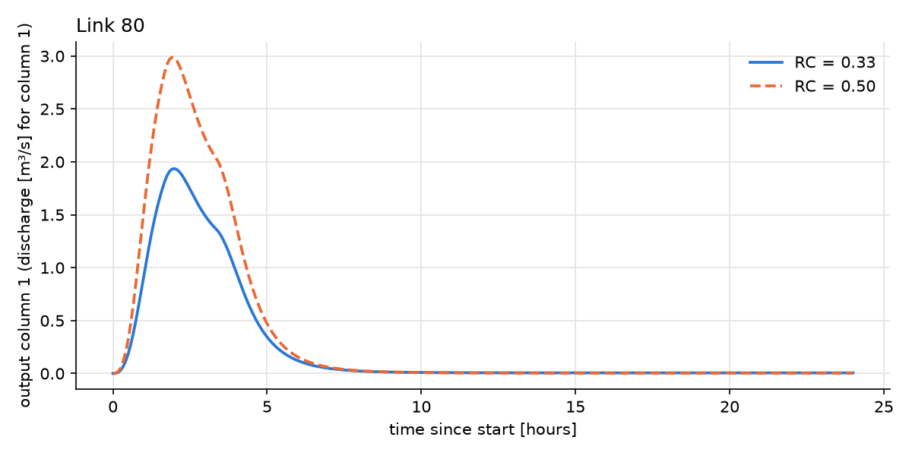

# 2. Running the model

<div class="meta-row"><span class="audience">Model users</span><span>No programming needed</span><span>20 minutes, with the exercise</span></div>

<p class="lead">The command, the examples, what each input file says, a first experiment, and how to read the
results.</p>

:::{note}
This chapter assumes ASYNCH is installed ([chapter 1](01_setup.md)). Commands are run from the `examples` folder.
`asynch` stands for the program: `../build/src/asynch` if you did not run `make install`, simply `asynch` inside
Docker.
:::

## 2.1 The command

```bash
mpirun -n 4 asynch myrun.gbl
```

| Part of the command | Meaning |
|---|---|
| `mpirun -n 4` | run on 4 processors (MPI processes). 1 is fine for small basins. More than your computer's cores needs `--oversubscribe` and is slower. |
| `asynch` | the program |
| `myrun.gbl` | the global file describing the run. Input and output file names written in it are relative to **the folder you are in**, not to the `.gbl` file |

Options, placed before the `.gbl`: `-m` (or `--more`) prints how long each initialisation step took;
`-v` prints the version; `-h` prints the help; `-d` waits for a key press at start, so a debugger can be attached.

:::{important}
With several processes the results can differ in the last digits from one run to the next (the asynchronous
scheduling, [chapter 4](04_how_the_solver_works.md)). With one process a run is exactly repeatable.
:::

## 2.2 The examples

All in `examples/`. Run times are for one process on a laptop-class computer.

| Global file | Basin, model | What it shows | Time |
|---|---|---|---|
| `test.gbl` | 11 links, model 190 (constant runoff coefficient) | the smallest complete run; one day, rain for 200 minutes | 1 s |
| `test_rkd.gbl` | same | tolerances and solver chosen per link, from `test.rkd` | 1 s |
| `test_2015.gbl` | same | the configuration that produced the reference results `results/test.*`; writes `.dat`/`.rec` into `out_2015/` | 1 s |
| `clearcreek.gbl` | 6 359 links, model 254 (top layer) | a larger network with the Top Layer model; one day | 4 s |
| `clearcreek_2015.gbl` | same | reproduces the reference results `results/clearcreek.*`: 100 hours from 2014-05-01 | 8 s |
| `more/model_*/test*.gbl` | 11 links, models 192, 196, 258, 259 | other models; run them from inside their folder (`cd more/model_192`) | 1 s |

Each example has reference results. Chapter 9 explains how they are checked automatically.

## 2.3 The global file (`.gbl`), block by block

The global file answers a fixed list of questions, **in a fixed order**. Lines starting with `%` are
comments, and blank lines are ignored. This is `examples/test.gbl`, with the meaning of each answer.
The complete reference is `docs/input_output.rst` (section *Global File Structure*).

| In `test.gbl` | Question | Notes |
|---|---|---|
| `190` | which model? | the model number; each needs its own parameters and files (`docs/builtin_models.rst`) |
| `2017-01-01 00:00` and `2017-01-02 00:00` | start and end (UTC) | inside ASYNCH, time is counted in **minutes since the start** |
| `0` | add parameter values to output file names? | 0 = no |
| `3` / `Time` / `LinkID` / `State0` | what to write in the hydrographs | `State0` is the first state (discharge q [m³/s]); `State6` the 7th, etc. |
| `Classic` | format of the peak-flow file | always `Classic` |
| `6  0.33 0.20 -0.1 0.33 0.1 2.2917e-5` | global parameters: how many, then the values | same for all links; meaning depends on the model (for 190: v_r, λ₁, λ₂, RC, v_h, v_g) |
| `30 10 30` | memory buffers | keep these values |
| `0 test.rvr` | network (0 = file) | |
| `0 test.prm` | link parameters (0 = file) | |
| `1 test.uini` | initial state (1 = same for all links) | 0 = `.ini` (per link), 2 = `.rec` snapshot, 4 = `.h5` snapshot |
| `2` then `1 test.str` then `7 evap.mon` + `1398902400 1588291200` | forcings: how many, then one block each | here rain from a `.str` file, and monthly evaporation (`7` = recurring, with the period in unix time) |
| `0` / `0` | dams, reservoirs | 0 = none |
| `5 5.0 outputs.h5` | hydrographs: format, interval [min], file | 1 = `.dat`, 2 = `.csv`, 5 = `.h5` table, 6 = `.h5` arrays |
| `1 test.pea` | peak flows: format, file | 1 = `.pea` |
| `1 test.sav` then `3` | which links: for hydrographs (the ids listed in `test.sav`), for peaks (3 = all links) | |
| `4 60 test.h5` | snapshots | 1 = `.rec` at the end; 3 = `.h5` at the end; 4 = `.h5` every 60 min, named `test_<unix time>.h5` |
| `tmp` | name for temporary files | |
| `.1 10.0 .9` | step-size control (facmin, facmax, safety factor) | keep these values |
| `0` then `2` | tolerances given below (1 = from an `.rkd` file); **which numerical solver** | `2` = Dormand–Prince, the solver of all examples. See [2.4](#24-choosing-the-numerical-solver) for the other choices and how to switch |
| 4 lines | tolerances per state: absolute, relative, absolute and relative for interpolated values | smaller = more accurate and slower |

## 2.4 Choosing the numerical solver

The *numerical solver* is the method ASYNCH uses to advance the equations of every link in time. You choose it with
**one number** in the global file, the number on the line after `%Numerical solver index`. The documentation calls
this number the *solver index*: "index 2" simply means "the solver you get when you write `2` there". There is no
hidden default: every global file states its solver, and all examples use `2`.

| Write | Solver | When to use it |
|---|---|---|
| `2` | **Dormand–Prince 5(4)** | the standard choice, used by all examples and by ASYNCH since 2015 |
| `4` | **Rodas5P**, stiff solver (since 1.7) | long runs and large networks: usually several times faster at the same accuracy, with more precise peaks. Not for models 21, 22, 23, 40, 261, 262 or a model 255 with dams |
| `0` | RK 3(2), lower order | tests and teaching; slower for the same accuracy |
| `1` | RK 4(3), lower order | idem |

Any other number (for example `3`) stops the run with a message ([2.8](#28-messages-you-may-see)).

*Why a stiff solver?* In a basin some water moves in minutes (a small hillslope) and some in days (the river, the
groundwater). Solvers `0` to `2` must then take very small steps even when nothing is happening. The stiff solver does
not have this limit, so it takes far fewer steps. The details and measurements are in
[chapter 4, section 4.7](04_how_the_solver_works.md#47-the-stiff-solver-index-4).

### Switching from Dormand–Prince (`2`) to the stiff solver (`4`)

Two changes, both in the `%Numerical solver settings` block at the end of the global file:

1. change the solver number from `2` to `4`;
2. **divide the four lines of error tolerances by 100** (for example `1e-4` becomes `1e-6`, `1e-6` becomes `1e-8`).

Before (Dormand–Prince), in a global file of model 254 (7 states, so 7 numbers per line):

```text
%Solver flag (0 = data below, 1 = .rkd)
0
%Numerical solver index (0 = RK 3(2), 1 = RK 4(3), 2 = Dormand-Prince 5(4), 4 = Rodas5P, stiff)
2
%Error tolerances (abs, rel, abs dense, rel dense)
1e-4 1e-4 1e-4 1e-4 1e-4 1e-4 1e-4
1e-6 1e-6 1e-6 1e-6 1e-4 1e-4 1e-4
1e-4 1e-4 1e-4 1e-4 1e-4 1e-4 1e-4
1e-6 1e-6 1e-6 1e-6 1e-4 1e-4 1e-4
```

After (stiff solver, tolerances ÷ 100):

```text
%Solver flag (0 = data below, 1 = .rkd)
0
%Numerical solver index (0 = RK 3(2), 1 = RK 4(3), 2 = Dormand-Prince 5(4), 4 = Rodas5P, stiff)
4
%Error tolerances (abs, rel, abs dense, rel dense)
1e-6 1e-6 1e-6 1e-6 1e-6 1e-6 1e-6
1e-8 1e-8 1e-8 1e-8 1e-6 1e-6 1e-6
1e-6 1e-6 1e-6 1e-6 1e-6 1e-6 1e-6
1e-8 1e-8 1e-8 1e-8 1e-6 1e-6 1e-6
```

Nothing else changes: same input files, same output files, same command. To go back, restore the `2` and the
original tolerances.

:::{admonition} Why divide the tolerances by 100?
:class: tip
The tolerances tell a solver how large an error it may make. Dormand–Prince is forced into small steps anyway, so it
ends up much more accurate than its tolerances ask. The stiff solver uses the tolerances fully. With the same numbers
it is about 16 times faster but its hydrographs differ by up to about 1 % of the peak flow; with tolerances ÷ 100 it is
about 6 times faster and as accurate as Dormand–Prince (peaks even more accurate). Measured with model 254 on a
6 359-link network ([section 4.7](04_how_the_solver_works.md#47-the-stiff-solver-index-4)).
:::

:::{admonition} Check it on your basin
:class: note
Speed-ups depend on the model and the basin. Before switching a production setup, run one event with both solvers and
compare the hydrographs at your gauges ([2.6](#26-exercise-change-a-parameter-and-compare) shows how to compare two
runs).
:::

**From Python**, the same two changes:

```python
from asynch import GlobalConfig

cfg = GlobalConfig.read("my_basin.gbl")
cfg.solver = 4                                              # stiff solver
for tol in (cfg.abstol, cfg.reltol, cfg.abstol_dense, cfg.reltol_dense):
    tol[:] = [v / 100 for v in tol]                         # tolerances / 100
cfg.write("my_basin_stiff.gbl")                             # run it with asynch, or with Simulation(cfg)
```

**Different solvers on different links.** With the solver flag `1`, the solver and the tolerances are read from an
`.rkd` file, one line per link, and the solver number is the last value of each line (`docs/input_output.rst`,
*RK Data Files*). This is rarely needed.

## 2.5 The other input files

The small files of the `test` example can be read by eye. Each starts with the number of links, then one block
per link, starting with its id:

::::{grid} 1 1 3 3
:gutter: 2
:class-container: anatomy

:::{grid-item-card}
`test.rvr` · the network
^^^
```text
11
1
3 2 8 3
9
0
```
+++
- `11` links in the file
- link `1` has `3` parents: links 2, 8 and 3
- link `9` has `0` parents: a headwater
:::

:::{grid-item-card}
`test.prm` · link parameters
^^^
```text
11
1
0.4267 0.2622 0.0469
9
0.0896 0.4318 0.0896
```
+++
- for link `1` (digits shortened here):
- upstream area [km²]
- channel length [km]
- hillslope area [km²]
:::

:::{grid-item-card}
`test.str` · rain
^^^
```text
11
1
3
0    40
100  20
200   0
```
+++
- link `1`: `3` values follow
- from minute 0: 40 mm/h
- from minute 100: 20 mm/h
- from minute 200: dry
:::
::::

The other files of the example:

| File | Content |
|---|---|
| `evap.mon` | 12 values: the potential evaporation of each month [mm/month] |
| `test.sav` | the link ids for which hydrographs are written |
| `.rkd` (optional) | tolerances and method per link; format in {doc}`../input_output` (*RK Data Files*) |
| `.uini` | the initial state: one value per state, used for every link (below) |

:::{card}
:class-card: anatomy

`clearcreek.uini` · the initial state
^^^
```text
254
0.000000

1e-6 0.0 0.0 0.0 0.0 0.0 1e-6
```
+++
- `254`: the model number (ASYNCH warns if it differs from the `.gbl`)
- `0.000000`: the initial time [min]
- then one value per state, used for every link. For model 254: q, s_p, s_t, s_s, s_precip, V_r, q_b
:::

If the file gives fewer values than the model has states, ASYNCH warns and sets the missing ones
to 0. For model 254, the last three are always recomputed anyway ([chapter 5](05_model_254_explained.md)).

## 2.6 Exercise: change a parameter and compare

The best way to learn the model is to change one thing and look at the effect. Here: the runoff
coefficient RC of model 190 (the fraction of rain that runs off; 4th global parameter), from 0.33 to 0.50.

<div class="steps">

1. **Copy the global file, and create a folder for the new results.**

   ```bash
   cd examples
   cp test.gbl test_rc05.gbl
   mkdir -p run_rc05
   ```

   ASYNCH does not create folders: if one is missing, it stops at once with
   `Error: cannot write the hydrographs: the folder "run_rc05" does not exist` (§2.8).

2. **Edit the copy.** Open `test_rc05.gbl` in a text editor (`nano test_rc05.gbl`, or any editor) and change four
   lines: the runoff coefficient, and the three output files, which go to the new folder (red: before, green: after).

   ```diff
   - 6  0.33  0.20      -0.1     0.33  0.1  2.2917e-5
   + 6  0.33  0.20      -0.1     0.50  0.1  2.2917e-5
   - 5 5.0 outputs.h5
   + 5 5.0 run_rc05/outputs.h5
   - 1 test.pea
   + 1 run_rc05/test.pea
   - 4 60 test.h5
   + 4 60 run_rc05/test.h5
   ```

3. **Run both, and plot the outlet (link 80).**

   ```bash
   mpirun -n 2 asynch test.gbl
   mpirun -n 2 asynch test_rc05.gbl
   python3 ../tools/python/plot_hydrographs.py --link 80 outputs.h5 run_rc05/outputs.h5 \
           --labels "RC = 0.33" "RC = 0.50" --out rc_compare.png
   ```

   :::{admonition} You should see
   :class: expect
   The peak of each run, and a new file `rc_compare.png` (below):

   ```text
   RC = 0.33: link 80, maximum 1.93612 at 2.00 h
   RC = 0.50: link 80, maximum 2.98869 at 1.92 h
   ```
   :::

</div>



A larger runoff coefficient gives a higher peak (+54 % for +52 % of RC), and the peak comes slightly
earlier: the channel velocity grows with discharge (the exponent λ₁ in the channel equation, chapter 5).
The same recipe works for any change: rain in the `.str` file, dates, tolerances, or another model.

## 2.7 Reading the results

| File | Content |
|---|---|
| `.pea` | one line per link: `link id  upstream area [km²]  time of peak [min]  peak discharge [m³/s]`, after 2 header lines (number of links, model) |
| `.dat` | hydrographs as text: for each saved link, a header `link id  number of rows`, then rows of the chosen outputs |
| `.csv` | hydrographs for spreadsheets: one group of columns per link |
| `.h5` (flag 5) | hydrographs as a table with columns `Time` [min], `LinkID`, `State0` ... (values stored in single precision) |
| `.h5` (flag 6) | hydrographs as arrays: `link_id`, `time` (unix time), `outputs[link, time, output]` |
| `.rec` / snapshot `.h5` | all states of all links at one time; can be the initial state of a next run (flags 2 and 4 of the initial-state block) |

::::{tab-set}
:::{tab-item} Without programming
`.pea`, `.dat` and `.csv` are text files, and open in any editor or spreadsheet. `h5dump -H file.h5` shows the
structure of an `.h5` file.
:::
:::{tab-item} With Python
`tools/python/asynch_io.py` reads every format into dictionaries `{link id: array}`:

```python
import sys; sys.path.insert(0, "../tools/python")
import asynch_io

h = asynch_io.read_h5_hydrographs("outputs.h5")     # {link: [time, State0]}
print("outlet peak:", h[80][:, 1].max(), "m3/s")

peaks = asynch_io.read_pea("test.pea")              # {link: (area, time of peak, peak)}
print(peaks[80])
```

and `tools/python/plot_hydrographs.py` plots one link from up to three files (§2.6). The `asynch` Python package
reads them too (`asynch.io`, [chapter 10](10_python.md)).
:::
::::

## 2.8 Messages you may see

| Message | Meaning, and what to do |
|---|---|
| `Warning: X.uini is written for model 252, but the global file uses model 254.` | the model number in the initial-state file differs from the `.gbl`: check that the file is meant for this model |
| `Warning: X.uini gives 4 initial value(s), model 254 has 7. ...` | fewer initial values than states: the others are 0, or computed by the model. Fine if intended |
| `Error: numerical solver index 3 in the global file is not valid. Use 0 (RK 3(2)), 1 (RK 4(3)), 2 (Dormand-Prince 5(4)) or 4 (Rosenbrock Rodas5P, for stiff equations).` | fix the number after `%Numerical solver index` |
| `Error: file X not found for .prm file.` (or `.rvr`, `.uini`, ...) | wrong name or wrong folder: file names are relative to where you run `asynch` |
| `Error: File X appears to be in Windows format.` | the file was edited on Windows: convert it with `dos2unix X` |
| `Error: Number of links in .str file differs from number of links in network` | the rain file does not match the network |
| `Error: cannot write the hydrographs: the folder "X" does not exist or is not writable. Create it before running.` | ASYNCH checks every output folder before computing: create the folder (`mkdir X`) or fix its permissions |
| `Error: some results could not be written. See the messages above.` | writing the results failed at the end of the run (disk full, folder deleted, ...); `asynch` then ends with an error code |
| `Error reading .rkd file ...` | see the format in `docs/input_output.rst` (*RK Data Files*) |
| `Warning: Obtained N parameters from .gbl file. Expected M for model ...` | more global parameters than the model uses; the extra ones are ignored |
