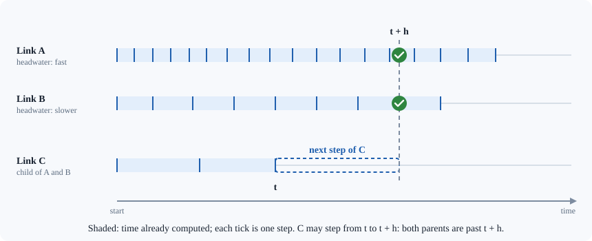
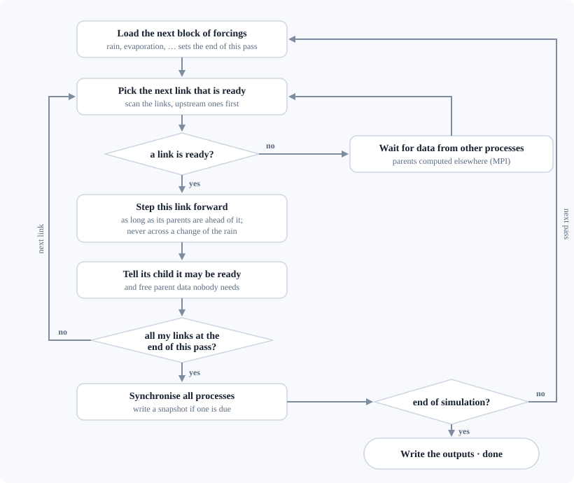
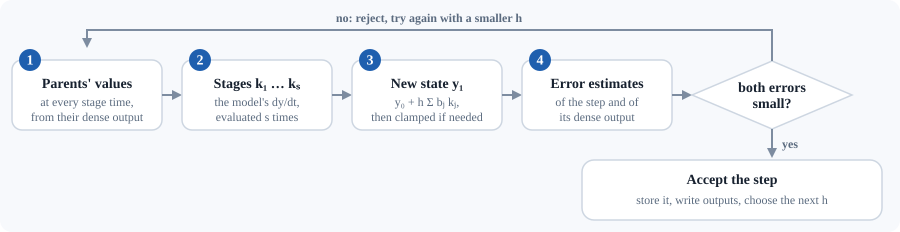

# 4. How the solver works (the mathematics behind `advance.c`)

<div class="meta-row"><span class="audience">Modellers, code readers</span><span>Some calculus</span><span>20 minutes</span></div>

<p class="lead">Why every link can have its own time step, how the scheduler decides which link to advance, and what
happens inside one Runge-Kutta step.</p>

Reference: S. Small, L. Jay, R. Mantilla, R. Curtu, L. Cunha, M. Fonley, W. Krajewski,
*An asynchronous solver for systems of ODEs linked by a directed tree structure*,
Advances in Water Resources 53 (2013) 23–32. Numerical background: Hairer, Nørsett &
Wanner, *Solving Ordinary Differential Equations I* (Springer), chapter II.4–II.6.

## 4.1 The problem

The river network is split into **links**. A link is a channel segment plus the
hillslope that drains into it. Each link *i* carries a small state vector
yᵢ(t) (for model 254: discharge, three storages, and three auxiliary states), governed by

$$
\frac{d\mathbf{y}_i}{dt} = \mathbf{f}_i\big(t,\ \mathbf{y}_i,\ \mathbf{y}_{\text{parent}_1}, \mathbf{y}_{\text{parent}_2}, \dots,\ \text{forcings}(t),\ \text{parameters}\big)
$$

The coupling only goes **downstream**: a link needs the states of its parents
(upstream links), never of its child. The whole system is one huge ODE (7 × 400 000
unknowns for Iowa), but it has a **tree structure**.

## 4.2 The key idea: every link has its own clock

A classical solver would advance all links together with one common step size. This
would be dictated by the fastest-changing link somewhere in the basin, which wastes work
everywhere else.

ASYNCH instead integrates each link **separately, with its own adaptive step size**. Link *i* can advance from
`last_t` to `last_t + h` as soon as **all its parents have already reached
`last_t + h`**. Within that interval it needs the parents' states at arbitrary times
(the intermediate RK stages t + cⱼh), and it gets them from the parents' **dense
output**: a polynomial that interpolates each accepted step of the parent to the same order of accuracy.

So the computation sweeps from the headwaters to the outlet, with each link running at
its own pace. Headwater links (no parents) can run ahead freely. A link waits only for
its own parents.



## 4.3 The scheduler (`src/advance.c`, function `Advance`)



:::{dropdown} The same loop as pseudo-code
```text
while t < end of simulation:                       # one "pass" per block of forcing data
    load the next block of forcing data (rain, ...) → sets maxtime for this pass
    write a snapshot if one is due
    compute an initial step size h for every link
    until every link I own has reached maxtime:
        pick the next link that is ready (a round-robin scan, upstream links first)
        if nothing is ready: exchange data with other MPI processes (Transfer_Data)
        else, for that link:
            leaf (no parents):  take steps until maxtime or until iter_limit steps are stored
            otherwise:          take steps while all parents are ahead of last_t + h
            shrink h so as not to step over a forcing change or a known discontinuity
            tell the child whether it can now take a step (child->ready)
            free the parents' solution nodes that nobody needs anymore
    synchronise all processes (barriers)
```
:::

Important details:

* `iter_limit` (first number of the `30 10 30` line in the `.gbl`) caps how many steps a
  link may store before its child consumes them. This bounds memory.
* Rain is piecewise constant, so its jumps are **discontinuities** of f. A step must not
  cross one, otherwise the error estimate becomes meaningless. Each link cuts its step at the next
  rain change (`forcing_change_times`). It also *propagates* the discontinuity time to its
  children, up to the method's order (`Insert_Discontinuity`), because the parent's
  solution is only C⁰/C¹ there.
* `my_sys` is sorted by `distance` (longest path to a headwater, largest first), and the
  scan runs from the end of the array, so upstream links are tried first.

## 4.4 One step of one link (`src/steppers/explicit.c`, `ExplicitRKSolver`)

An explicit Runge–Kutta method with *s* stages (Butcher coefficients A, b, c):

$$
\mathbf{k}_j = \mathbf{f}\Big(t + c_j h,\ \ \mathbf{y}_0 + h \sum_{l<j} A_{jl}\,\mathbf{k}_l,\ \ \text{parents}(t + c_j h)\Big), \qquad j = 1,\dots,s
$$

$$
\mathbf{y}_1 = \mathbf{y}_0 + h \sum_{j=1}^{s} b_j\,\mathbf{k}_j
$$



In the code:

1. **Parents at the stage times.** For each parent and each stage, find the stored step
   containing `t + c[j]*h`, and evaluate its dense output (`dense_b(theta)` gives the
   weights b(θ), with θ ∈ [0,1] the relative position inside the step).
2. **Stages** `temp_k[i]` are computed with `link_i->differential(...)`, i.e. the model function.
3. **New state** `new_y = y₀ + h Σ b[i] k[i]`, passed through `check_consistency` (clamping).
4. **Two error estimates**, each measured in a scaled max-norm

   $$
   \text{err} = \max_i \frac{|\text{estimate}_i|}{\text{atol}_i + \text{rtol}_i \cdot \max(|y_{0,i}|,\ |y_{1,i}|)}
   $$

   * `err_1` for the step itself (coefficients `e`),
   * `err_d` for the dense output (coefficients `d`). This one is specific to ASYNCH:
     the interpolated values are what the child links consume, so they must also be accurate.
5. **Accept** if both are < 1. The new step size is

   $$
   h_\text{new} = h \cdot \min\!\Big(\text{facmax},\ \max\big(\text{facmin},\ \text{fac}\cdot(1/\text{err})^{1/\text{order}}\big)\Big)
   $$

   taking the smaller of the two proposals. `facmin, facmax, fac` are the `.1 10.0 .9` line of the `.gbl`.
6. If accepted: store the stage values k (only for the "dense" states, e.g. q), write
   outputs that fall inside the step (by dense output), update the peak flow, advance
   the forcing index if a rain change was reached, free the parents' old nodes.
   If rejected: discard the node and retry with the smaller `h`.

Available methods (index in the `.gbl`):

| index | method | stages | order (step / dense) |
|---|---|---|---|
| 0 | RK 3(2) dense | 3 | 3 / 2 |
| 1 | RK 4(3) dense | 4 | 4 / 3 |
| 2 | Dormand–Prince 5(4) dense | 7 | 5 / 4 |
| 3 | Radau IIA (implicit) | | <span class="st open">not usable</span> its solver is not compiled, and ASYNCH refuses the index |

## 4.5 Initial step size (`src/rksteppers.c`, `InitialStepSize`)

This follows Hairer–Nørsett–Wanner's algorithm (vol. I, II.4): estimate `h0` from
‖y₀‖/‖f(y₀)‖, do one explicit Euler step, estimate the second derivative, and choose
`h1 = (0.01 / max(d1, d2))^(1/(p+1))`. It is called at the start and after every forcing change.
*Note:* the code uses a threshold `max(d1,d2) < 0.1` where the textbook uses `≤ 1e-15`
to switch to `max(1e-6, h0·1e-3)`. This only changes the first trial step, which the
error control then corrects.

## 4.6 Why results change slightly with the number of processes

:::{note}
With one process a run is exactly repeatable. With several, the last digits can change from run to run, always within
the tolerances you set.
:::

With several MPI processes, the order in which links are computed, and the time when
parent data arrives, depend on timing. The step sequence of a link, and hence its
numerical error, can therefore differ slightly from run to run. Every result is still
within the requested tolerances, and the differences are of that size (see
[09_reproducibility.md](09_reproducibility.md), R-05).
