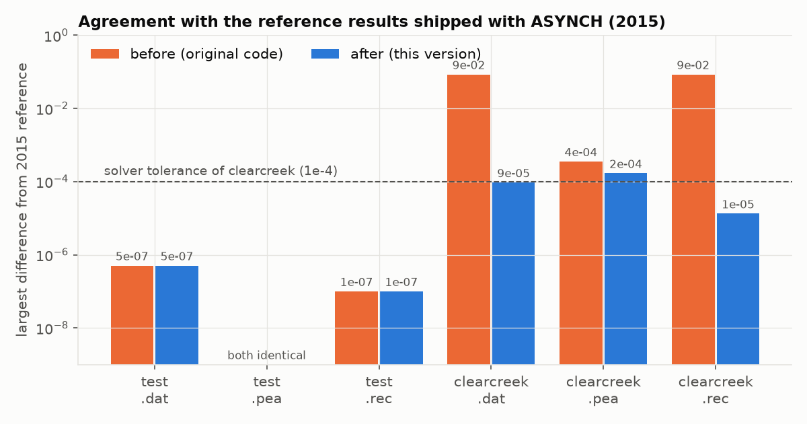
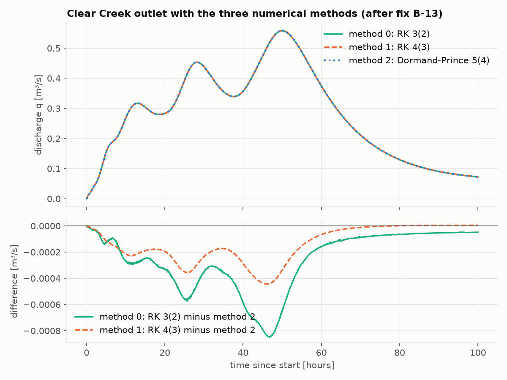
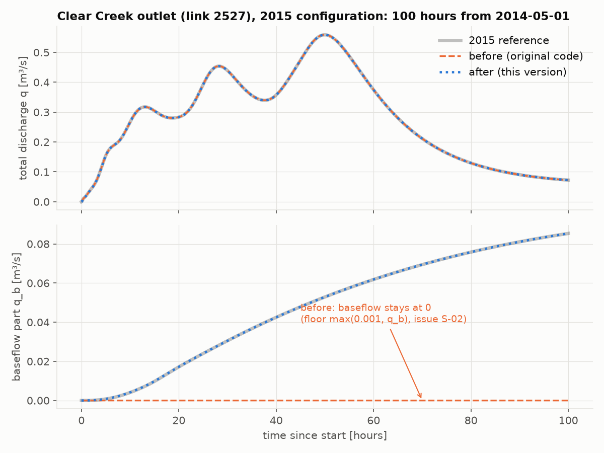

# 7. What was fixed, and why it matters

*Written for readers who do not program. Each item also has a short "C lesson" for those who
are learning the code; the full technical record is chapter 8 (`08_known_issues.md`), and every
change is in `CHANGELOG.md`.*

## 7.1 How every change was checked

Two comparisons are made after **every** change to the code:

1. **Against the results shipped with the original ASYNCH repository** (`examples/results/`,
   `examples/more/*/results_benchmark/`). These reference files are never modified. They are the benchmark.
2. **Against the original code itself**, run on the same inputs. With one processor, an unchanged
   result must be **identical to the last digit**; only a change that is meant to alter results may
   differ, and then the difference is measured and explained.

On top of that, special builds of the program that stop at the first memory error (the "sanitizers",
chapter 9) run every example. Chapter 9 explains how to repeat all of this yourself, with one command.

The figure below summarises the outcome against the six reference files of 2015: the orange bars are the
original code, the blue bars this version. Lower is better; below the dashed line means "within the solver's accuracy".

## 7.2 How serious is a bug? The four classes

| Class | Meaning for a user of the model |
|---|---|
| **Critical** | Can give **wrong numbers without any warning**, or crash, with standard settings or the shipped examples |
| **High** | Wrong numbers, a crash or an endless run in a documented option or a plausible setup; or results lost without being told |
| **Medium** | A crash with an obvious cause, or differences far too small to matter hydrologically |
| **Low** | No effect on results: messages, warnings, tidiness of the code |

A "silent" error is always worse than a crash: a crash is noticed, a wrong number is not.

## 7.3 Overview

| Area | Issue | Class | Status |
|---|---|---|---|
| Numerical solver | B-13: solver methods 0 and 1 computed with random numbers | **Critical** | fixed |
| Memory / outputs | B-01: the main example overwrote memory; crashed on one processor | **Critical** | fixed |
| Model equations | S-02: model 254 baseflow forced to 0 by a line added in 2021 | **High** | fixed (original equation restored) |
| Inputs | B-12: missing initial values were taken from random memory | **High** | fixed |
| Numerical solver | B-14: per-link solver settings (`.rkd`) never worked | **High** | fixed |
| Outputs | B-15: a missing output folder loses all results, yet the run "succeeds" | **High** | open |
| Numerical solver | B-04: an invalid solver number crashed the program | Medium | fixed |
| Outputs | B-02: snapshots depended slightly on the number of processors | Medium | fixed |
| Program end | B-03: debug versions crashed at the very end | Medium | fixed |
| Examples | two examples pointed to a computer at the University of Iowa | Medium | fixed |
| Memory | B-05, B-07, B-08: freeing the wrong memory, a leak, misaligned reads | Low | fixed |
| Messages | B-09, B-10: debug text printed at every step; compiler warnings | Low | fixed |

## 7.4 The critical issues

### B-13: solver methods 0 and 1 computed with random numbers — Critical

**What happened.** ASYNCH offers three numerical methods (the `%Numerical solver index` in the `.gbl`):
0 = RK 3(2), 1 = RK 4(3), 2 = Dormand–Prince 5(4). Each method is defined by a small table of fixed
coefficients. For methods 0 and 1 these tables were stored in a temporary place in memory that is
released as soon as the setup is finished. Every time step then read whatever happened to be in that place.

**Why it matters.** Results computed with method 0 or 1 by earlier versions of ASYNCH are unreliable:
the run either computed with meaningless coefficients, or never finished (the `test` example ran forever
in most attempts). Method 2, which all examples use, stores its table correctly and was never affected.

**Now.** The three methods run and agree with each other as they should (figure below: the curves overlap;
the lower panel shows that the differences stay below 0.00085 m³/s, which is 0.15 % of the peak).

*C lesson* ([6.6](06_c_primer.md#66-memory-malloc--free)): a variable declared inside a function lives only
while the function runs. Keeping its address afterwards is a "dangling pointer". The fix was one word, `static`,
which makes the table live for the whole program.

### B-01: the main example overwrote memory — Critical

**What happened.** When writing a snapshot, model 254 used a filter written for model 256, which has
one more state. For each link it touched one number more than exists, writing into the neighbouring link's data,
and for the last link past the end of the memory reserved for the file. The cause was a single missing word,
`break`, in the list of models.

**Why it matters.** The flagship example `clearcreek.gbl` **crashed** on one processor. On several processors it
seemed to work, but memory was being overwritten, which can corrupt results in ways that cannot be predicted.

**Now.** Runs on any number of processors. The fix itself changed no result: on two processors, all 27 output
files were identical to the original's. (Model 254 results changed later, on purpose, with S-02 below.) *C lesson* ([6.7](06_c_primer.md#67-switch-falls-through)): in C, a `switch` keeps
running into the next case until it meets `break`.

## 7.5 The high-severity issues

### S-02: model 254 baseflow forced to zero — High

**What happened.** Model 254 tracks, besides the total discharge, the part of it that comes from
groundwater (baseflow, state `q_b`). In January 2021 one line of the model was changed, inside a code change titled
"added model 194", so that the channel always lost baseflow *as if* there were at least 0.001 m³/s of it. When there
was less, the model removed water that was not there, and the baseflow was pushed to zero. This line is not part of
the published model or of its documentation.

**Why it matters.** Over the 100-hour Clear Creek run, the reference baseflow at the outlet rises to 0.085 m³/s.
The 2021 code kept it at **0 for the whole run**: a 100 % error on that output. The total discharge was almost
unaffected (at most 0.0003 m³/s), because in this model the baseflow state is bookkeeping: it reports how much
of the flow is baseflow, and does not feed back into the total. Anyone using the baseflow output of model 254
since 2021 was affected.

**Now.** The original equation is restored (decision of the model owner). The reference results shipped with
ASYNCH are reproduced within the accuracy of the solver.

### B-12: missing initial values taken from random memory — High

**What happened.** The initial-state file (`.uini`) gives one starting value per state. If it gave fewer values
than the model needs, ASYNCH did not notice, and the missing states started from whatever was in memory.

**Why it matters.** It happened in the shipped examples: models 258 and 259 need 4 values, but their file gives 3,
so the subsurface storage started from random memory. By luck that memory was 0; on another computer it may not be.

**Now.** Missing values are 0, a warning says so, and a mismatch between the model number in the file and in the
`.gbl` is reported. *C lesson* ([6.8](06_c_primer.md#68-reading-files-always-check-the-return-value)):
reading functions report end-of-file with a special value, which must be checked.

### B-14: per-link solver settings never worked — High

**What happened.** The `.rkd` option (a file giving tolerances and method for each link) is part of the documented
input format. Reading it contained five separate mistakes, the first being an endless loop: the program never got past
"Reading dam and reservoir data...".

**Now.** Rewritten and tested: a file that repeats the global settings for every link gives results identical to the
normal run, and a faulty file stops with a clear message. The format is now documented and has an example (`examples/test.rkd`).

### B-15: results silently lost when an output folder is missing — High, open

If a folder named in the `.gbl` for the outputs does not exist, ASYNCH prints `Error: could not open ...` lines but
**runs to the end and reports success**, without writing results. Until this is fixed, create the output folders
before a run, and look for `Error` lines in the output.

## 7.6 Medium and low issues, in brief

* **B-04** (Medium): a solver number other than 0, 1 or 2 (the `.gbl` comment even suggested 3 and 4) crashed
  the program. It now stops with a message listing the valid values.
* **B-02** (Medium): snapshot values below 10⁻¹² were set to 0 only for links computed by the first processor, so
  snapshots differed slightly with the number of processors. Now the same rule applies to every link.
* **B-03** (Medium): the output file was closed twice at the very end, which crashed "debug" versions of the program
  (results were already written). Fixed.
* **Examples 258/259** (Medium): pointed to a file on a University of Iowa computer, so they could not run anywhere
  else. They now use the evaporation file shipped in the repository, and reproduce their reference exactly.
* **B-05, B-07, B-08** (Low): memory handling errors that did not change results: freeing the wrong address, a
  buffer never released, numbers read from misaligned memory addresses.
* **B-09, B-10** (Low): models 402 and 403 printed a debug line at every step; compiler warnings about
  a missing declaration and a wrong print format.

## 7.7 Tools added along the way

* `tests/regression/run_examples.py`: runs every example and compares every output with the references and,
  optionally, with the original code (chapter 9).
* `examples/test_2015.gbl`, `examples/clearcreek_2015.gbl`: the configurations that produced the 2015 reference
  results, recovered from the repository history and translated to today's format.
* `tools/python/asynch_io.py`, `tools/python/plot_hydrographs.py`: read and plot the outputs (chapter 2).
* `tools/python/make_comparison_plots.py`: regenerates the figures of this chapter.
* `Dockerfile`: a tested, ready-made environment (chapter 1).
