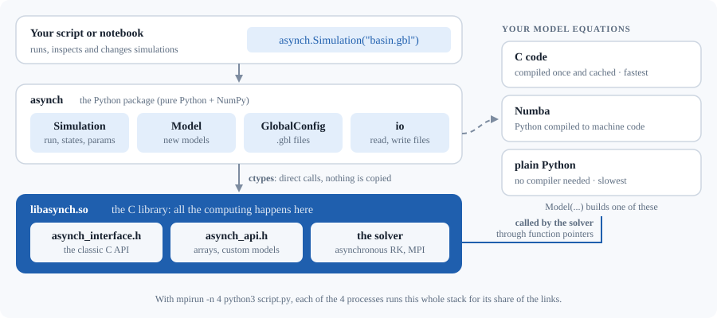
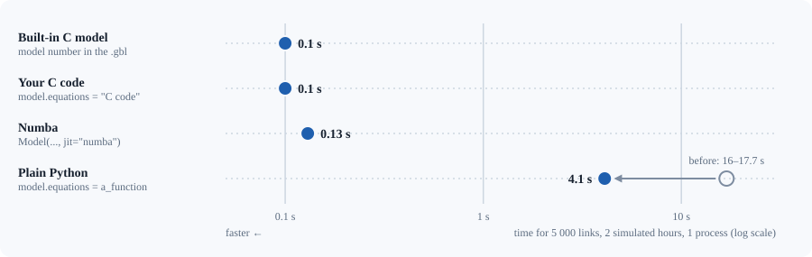

# 10. Using ASYNCH from Python

<div class="meta-row"><span class="audience">Python users</span><span>Some Python</span><span>30 minutes</span></div>

<p class="lead">ASYNCH's numerical work is done by a C library. The <code>asynch</code> Python package drives that
library: it reads global files, runs simulations, reads and changes the states and parameters of every link while the
model runs, and lets you define new models in Python while the computation still runs in C.</p>

::::{grid} 1 2 2 4
:gutter: 2

:::{grid-item-card} {octicon}`play` Run
:link: "#103-first-steps-run-a-global-file"
:link-type: url
A global file, like the `asynch` program.
:::

:::{grid-item-card} {octicon}`sliders` Inspect
:link: "#104-states-parameters-and-time"
:link-type: url
States and parameters, while it runs.
:::

:::{grid-item-card} {octicon}`beaker` New model
:link: "#107-a-new-model"
:link-type: url
Equations in C, Numba or Python.
:::

:::{grid-item-card} {octicon}`cpu` MPI
:link: "#109-several-processors-mpi"
:link-type: url
Several processors, from Python.
:::
::::

The old Python interface (`py/`, `asynchdist.py`) had been broken for years (issue A-01, chapter 8)
and is replaced by this package.

## 10.1 What you get

| Python | What it does |
|---|---|
| `Simulation` | runs a global file like the `asynch` program (the output files are **identical to the last byte**), and lets you advance step by step, read/change states and parameters, and add outputs |
| `Model` | a new model: its equations written in **C code** (compiled once, as fast as a built-in model), as **Python functions compiled by Numba** (as fast), or as plain **Python functions** (no compiler, about 40 times slower) |
| `GlobalConfig` | reads, changes and writes global files (`.gbl`), so a setup can be built in a script |
| `asynch.io` | reads the output files (`.dat`, `.csv`, `.h5`, `.pea`, `.rec`) and writes the input files (`.rvr`, `.prm`, `.uini`, `.str`, `.ustr`, `.mon`, `.sav`, binary rain files) |
| `python3 -m asynch` | `run file.gbl`, `info file.gbl`, `library` from the command line |

Examples that run as they are: `examples/python/` (each is also a test, see 10.11).

## 10.2 Installation

### Is it a library?

Yes: `asynch` is an ordinary Python package (a folder with `__init__.py` and a `pyproject.toml`), installed with pip
and used with `import asynch`, like NumPy or h5py. It has two parts, as h5py has (h5py is the Python face of the C
library HDF5):

| Part | What it is | Installed by |
|---|---|---|
| the C library `libasynch.so` | the solver, the models, the file readers: all the computation | `make install` (with the rest of ASYNCH), or inside the ready-made wheel |
| the Python package `asynch` | a thin layer that calls the library (with `ctypes`, part of Python) | `pip install` or `make install-python` |

Keeping the computation in the C library means one solver for the `asynch` program, C programs and Python, so a run
from Python gives exactly the numbers of the program (tested: identical files). The package finds the library by itself
(see *Check* below).



### Install

Python 3.8 or newer and NumPy are required; optional: h5py (to read `.h5` files), Numba (models written in Python at
C speed, 10.7), mpi4py (only to use MPI from your own Python code, 10.9). A C compiler is needed for models written
in C; it is already installed if you built ASYNCH.

::::{tab-set}
:::{tab-item} Ready-made wheel
Nothing to build: each [release](https://github.com/gurbuzf/asynch/releases) has a wheel for Linux that carries the
library and the `asynch` program already compiled, with the libraries they need (HDF5, ...). pip installs MPI with it
(the `mpich` package of PyPI, which also provides `mpiexec`).

```bash
python3 -m venv ~/asynch-venv && source ~/asynch-venv/bin/activate
pip install --upgrade pip        # pip 20.3 or newer reads the wheel's platform tag
pip install https://github.com/gurbuzf/asynch/releases/download/v1.5.0/asynch-1.5.0-py3-none-manylinux_2_31_x86_64.whl
pip install h5py numba           # optional: read .h5 outputs; models in Python at C speed
```

It runs on Linux x86-64 with glibc 2.31 or newer (Ubuntu 20.04+, Debian 11+, RHEL 9+, ...) and Python 3.8 or newer.
It also installs the command `asynch`, the program itself (`asynch test.gbl`, `mpiexec -n 4 asynch test.gbl`). A C
compiler is needed only for models written as C code. Tested: the wheel is installed on systems with nothing else
(no compiler, MPI or HDF5), and the tests of the package and every example against the reference results pass.
:::

:::{tab-item} Ubuntu or WSL
After `make` in `~/asynch/build` (chapter 1, option A):

```bash
cd ~/asynch/build
sudo make install && sudo ldconfig       # asynch -> /usr/local/bin, libasynch.so -> /usr/local/lib

# The package: Ubuntu 24.04 installs pip packages only in a virtual environment
sudo apt-get install -y python3-venv python3-setuptools python3-wheel
python3 -m venv --system-site-packages ~/asynch-venv     # --system-site-packages: reuse numpy/h5py of apt
make install-python PYTHON_FOR_ASYNCH=~/asynch-venv/bin/python
source ~/asynch-venv/bin/activate                         # in every new terminal (or add it to ~/.bashrc)
pip install numba                                         # optional, for jit="numba"
```

`make install-python` runs `pip install --no-build-isolation ~/asynch/python` with that Python: `pip install
~/asynch/python` does the same (without `--no-build-isolation`, pip downloads `setuptools` first). The package is
then in the environment's `site-packages`, and the command `asynch-py` is available (the same as `python3 -m asynch`).
Extras: `pip install "~/asynch/python[all]"` also installs h5py, numba and mpi4py.
:::

:::{tab-item} Docker
Nothing else is needed: the image of chapter 1 (option B) has the package ready.

```bash
docker run --rm -it asynch
python3 python/run_example.py            # inside the container, in /asynch/examples
```
:::

:::{tab-item} Without installing
For a quick try from the source tree:

```bash
export PYTHONPATH=~/asynch/python
```
:::
::::

### Check

```bash
python3 -m asynch library
```

:::{admonition} You should see
:class: expect
The path of the library, e.g. `/usr/local/lib/libasynch.so`.
:::

The package looks for it, in order, in the
environment variable `ASYNCH_LIBRARY`, next to the package, in the build folder of the source tree
(`~/asynch/build/src/.libs/`), then in the system folders. To use a particular build:

```bash
export ASYNCH_LIBRARY=~/asynch/build/src/.libs/libasynch.so
```

## 10.3 First steps: run a global file

As with the `asynch` program, the paths inside a global file are relative to the folder you run from, so work in
`examples/`:

```bash
cd ~/asynch/examples
python3
```

```python
>>> from asynch import Simulation
>>> sim = Simulation("test_2015.gbl")      # reads the file, loads network, parameters, initial state, rain
>>> sim.num_links, sim.model_uid, sim.duration_total
(11, 190, 300.0)
>>> sim.run()                               # integrates 300 minutes and writes out_2015/test.dat, .pea, .rec
>>> t, q = sim.peaks                        # time of peak [min] and peak discharge [m3/s], for every link
>>> q[sim.location(80)]                     # link 80 is the outlet
1.9362544...
>>> sim.close()                             # frees the C memory and deletes the temporary files
```

`with Simulation(...) as sim:` closes it for you. The same run as a script is `examples/python/run_example.py`; from the
command line, `python3 -m asynch run test_2015.gbl` does exactly what `asynch test_2015.gbl` does.

**Link order.** Every per-link array of `Simulation` (states, peaks) is in *location* order, the internal order of
ASYNCH. `sim.link_ids[k]` is the id of row `k`, and `sim.location(link_id)` the row of a link id.

## 10.4 States, parameters and time

```python
from asynch import Simulation

with Simulation("test_2015.gbl") as sim:
    sim.advance(60)                   # integrate 60 minutes (without writing the output files: see below)
    print(sim.time)                   # 60.0
    s = sim.states                    # array [11 links, 3 states]; for model 190: q, s_p, s_a
    t, y = sim.state(80)              # time and states of one link

    g = sim.global_params             # [0.33, 0.2, -0.1, 0.33, 0.1, 2.2917e-05]
    g[3] = 0.5                        # model 190: RC, the runoff coefficient
    sim.global_params = g             # applies from now on; the derived link parameters are recomputed

    s[:, 0] *= 1.1                    # 10 % more water in every channel
    sim.set_states(s)                 # restart the solver from these states, at the current time
    sim.run()                         # the rest, then write the outputs
```

What happens underneath, so that the numbers mean what you think:

* **Derived parameters.** Most models compute link parameters from the global ones once, at the start
  (model 190: `c_1 = RC * 0.001/60`, `invtau`, ...). Setting `global_params` or calling `set_link_params` recomputes
  them for every link. Tested: changing RC from Python gives *exactly* the run of a global file with that RC.
* **`advance(minutes)` / `advance(until=...)`.** The solver takes its own time steps; stopping at 60 minutes forces a
  step to end there. The solution is the same within the solver's tolerance, not to the last digit (measured on
  `test_2015`, stopping 4 times: the final discharges change by up to 0.24 %, 8.5e-6 at most in absolute value,
  well inside the absolute tolerance 1e-3 of the global file).
* **`set_states`** restarts the time stepping at the current time from the given states (the history of past steps
  used to interpolate upstream values is reset). Continuing from `sim.states` unchanged gives the uninterrupted
  solution within the tolerance.
* **Hydrographs** are written to temporary files during `advance`, and assembled into the output file by
  `write_outputs()` (called by `run()`); `advance(write=False)` skips them.
* **Peaks** are the largest discharge since the start (or since `reset_peaks()`).

Other useful calls: `sim.parents(id)`, `sim.child(id)`, `sim.get_link_params(id)`, `sim.forcing_values(id)` (rain,
evaporation... now), `sim.activate_forcing(0, False)` (switch the rain off), `sim.snapshot("state.rec")` (save the
states), `sim.set_initial_file("state.rec")` (start from saved states; before `load()`).

A sensitivity loop (`examples/python/sensitivity.py`) is just a loop of simulations:

```python
for rc in (0.2, 0.33, 0.5, 0.7):
    with Simulation("test_2015.gbl") as sim:
        g = sim.global_params; g[3] = rc; sim.global_params = g
        sim.advance(write=False)
        t, q = sim.peaks
        print(rc, q[sim.location(80)])
```

```
0.20 1.1444
0.33 1.9363
0.50 2.9887
0.70 4.2407
```

## 10.5 Global files from Python

`GlobalConfig` reads a global file into Python objects, in the order ASYNCH reads it (`src/config_gbl.c`), and writes
it back. Every example global file survives `read` then `write` unchanged (tested).

```python
from asynch import GlobalConfig, Simulation
from asynch.config import Output

cfg = GlobalConfig.read("test_2015.gbl")
cfg.end = "2014-05-01 10:00"                            # 10 hours instead of 5
cfg.global_params[3] = 0.5                               # RC
cfg.hydrographs = Output(2, 15.0, "out_2015/rc05.csv")   # .csv, every 15 minutes
cfg.write("rc05.gbl")                                    # a file you can also give to the asynch program

with Simulation(cfg) as sim:                             # or directly, without writing a file
    sim.run()
```

The attributes, and the classes for the blocks with options (`Forcing`, `Output`, `PeakOutput`, `Snapshot`,
`Selection`, `FileRef`), are listed with `help(GlobalConfig)`; the numbers of the flags are those of the global file
(docs/input_output.rst).

## 10.6 Your own outputs

A global file lists the time series to write under `%Components to print`. Besides the built-in `Time`, `State0`,
`State1`, ..., any name can be used, if the program says how to compute it:

```python
cfg = GlobalConfig.read("test_2015.gbl")
cfg.outputs = ["Time", "State0", "Storage_mm"]
cfg.write("mine.gbl")

with Simulation("mine.gbl", load=False) as sim:          # load=False: define outputs before loading
    # function(link id, time [min], states of the link) -> value; states=[1, 2]: the states it uses
    sim.set_output("Storage_mm", lambda link, t, y: 1000.0 * (y[1] + y[2]), states=[1, 2])
    sim.load()
    sim.run()
```

The peak file format can be changed too (`set_peakflow_output`, see `examples/python/custom_model.py`).

*Fixed on the way (B-20):* the C function behind `set_output` was supposed to make the solver interpolate the states
an output uses; it did the opposite, so such outputs were written as 0.

## 10.7 A new model

A model is a set of differential equations, solved at every link. You give names to the states and parameters, and
write the equations with those names.

```python
from asynch import Model, Simulation

model = Model(
    name="linear_reservoir",
    states=["q"],                      # state 0 should be the discharge [m3/s]
    global_params=["k"],               # the same everywhere, from the global file
    params=["A_h"],                    # per link, from the .prm file
    forcings=["rain"],                 # from the global file, in this order
    param_factors={"A_h": 1e6},        # km2 in the .prm file -> m2
)
model.equations = """
    double inflow = upstream_q + rain * A_h * (0.001 / 3600.0);    /* mm/h on m2 -> m3/s */
    d_q = (inflow - q) / k;
"""

with Simulation("chain.gbl", model=model) as sim:     # the network of 10.8
    sim.run()
```

In the C code, every name is a variable holding its current value: states (`q`), global parameters (`k`), link
parameters (`A_h`) and forcings (`rain`). You set `d_q`, the time derivative of `q` (per minute: ASYNCH's time unit is
the minute). `upstream_q` is the sum of `q` over the links upstream. The code is plain C: `if`, `pow`, `exp`, `fmax`
and local variables are allowed. It is compiled the first time (a fraction of a second) and kept in
`~/.cache/asynch/models` for the next runs.

**Options of `Model`** (all described in `help(Model)`):

| Option | Meaning |
|---|---|
| `derived_params` + `model.precalculations` | parameters computed once per link from the others, e.g. `"k2 = v_h * L / A_h * 60.0;"` |
| `read_initial` | the states given in the initial-state file (the first ones); the others start at 0 ... |
| `model.initialize` | ... or are computed here, e.g. `"q_b = q;"` |
| `dense` | the states that downstream links use (default: the first); `upstream_<name>` exists for each |
| `nonnegative` | `"discharge"`: keep q >= 1e-14 and the other states >= 0 (as models 190-254); `"all"`: every state >= 0 |
| `model.consistency` | your own rule, applied after every stage, e.g. `"if (s < 0.0) s = 0.0;"` |
| `param_factors` | unit conversions of the parameters read from disk |
| `area`, `hillslope_area` | the parameters written in the peak file (upstream area, and whether it was converted to m2) |
| `model.support_code` | C functions you want to call from the equations |

**Python functions instead of C.** No compiler needed; the arrays are NumPy views of the C memory:

```python
def equations(t, y, upstream, gp, p, forcing):
    # y: states of this link; upstream: array [number of parents, max states] of the upstream states
    inflow = upstream[:, 0].sum() + forcing[0] * p[0] * (0.001 / 3600.0)
    return [(inflow - y[0]) / gp[0]]
model.equations = equations
```

`precalculations(gp, p)` returns the derived parameters, `initialize(gp, p, y)` the initial states,
`consistency(y, gp, p)` changes `y` in place. If a Python function raises an exception, the simulation stops at the next
return to Python with a `ModelError` naming it.

**Python at C speed: Numba.** Add `jit="numba"` and the same Python functions are compiled by
[Numba](https://numba.pydata.org) (`pip install numba`) into machine code with the signature ASYNCH calls; the solver
then never goes back to Python:

```python
model = Model(states=["q"], global_params=["k"], params=["A_h"], forcings=["rain"],
              param_factors={"A_h": 1e6}, jit="numba")
model.equations = equations              # the function above, unchanged
```

The functions must then use what Numba supports (NumPy arrays, arithmetic, `math`, loops, `if`) and return a tuple, a
list or an array; they are compiled when the simulation starts (about a second).

**Which one?** Measured on model 190 rewritten each way, 5 000 links, 2 simulated hours, one process (the results of
all four are identical to the last bit):



| Equations | Run time | |
|---|---|---|
| built-in model (C) | 0.10 s | reference |
| C code (`model.equations = "..."`) | 0.10 s | same speed; needs a C compiler |
| Python functions, `jit="numba"` | 0.13 s | + ~1 s compilation at start; needs Numba |
| Python functions | 4.1 s | no compiler at all; good for small networks and trying ideas |

The plain Python mode was 16 s before a change of 2026-09-26: most of the time went into building NumPy views of the C
arrays at every call, which are now cached (the remaining 4 s are the Python code of the equations itself).

**Is my model right?** Two checks are built into the tests and worth repeating for your own models:

* *Reproduce a built-in model.* `examples/python/custom_model.py` writes model 191 in C through the package: the
  results are identical to the built-in model 191, to the last bit. Tip: identical numbers need the same order of
  operations (C does not reorder additions, and `(a + b) + c` can differ from `a + (b + c)` in the last digit).
* *Compare with an exact solution.* A chain of linear reservoirs has one: `tests/python/test_model.py` checks chains of
  1, 2 and 5 links, with and without rain, against it (agreement better than 1e-8).

## 10.8 A new network, from scratch

`examples/python/new_network.py` writes everything with `asynch.io` and `GlobalConfig`: the network (`write_rvr`, a
dictionary from each link to its upstream links), the parameters (`write_prm`), the initial state (`write_uini`), the rain
(`write_ustr`), the global file, and a model; then runs it. Run it with `python3 python/new_network.py my_folder`.

## 10.9 Several processors (MPI)

Yes, Python and MPI work together, with or without mpi4py. Start Python with `mpirun`: every process runs the same
script, and ASYNCH shares the links between them.

```bash
mpirun -n 4 python3 python/run_example.py clearcreek_2015.gbl
```

(Its largest peaks are not at the outlet, 0.56 m3/s, but at links 4086-4090, 0.58 m3/s: the flood wave flattens as it
travels down. The 2015 reference results show the same.)

<div class="stats">
<div><p>2.9×</p><p>faster on 4 processes: Clear Creek from Python</p></div>
<div><p>2.8×</p><p>faster on 4 processes: a model in plain Python</p></div>
<div><p>0</p><p>changes to your script: just <code>mpirun -n 4</code></p></div>
</div>

**What it gains** (measured on a 4-core computer; each row gives the same results):

| Run | 1 process | 2 processes | 4 processes |
|---|---|---|---|
| Clear Creek, 6 359 links, model 254, 100 h (from Python) | 8.0 s | 4.3 s | 2.75 s (2.9x) |
| 50 000 links, model 190 built-in, 6 h | 1.41 s | 0.98 s | 0.70 s (2.0x) |
| same, model 190 in Python with `jit="numba"` | 2.00 s | 1.23 s | 0.88 s (2.3x) |
| same, model 190 in plain Python | 56.6 s | 32.5 s | 20.1 s (2.8x) |

The 50 000-link network is a single long main channel with side streams, which is hard to share between processes;
real basins such as Clear Creek branch more and gain more.

:::{admonition} Rules for scripts run with MPI
:class: important
* `sim.rank` (0 .. n-1) and `sim.num_procs` tell a process who it is. Print from rank 0 only.
* `sim.states`, `sim.peaks`, `set_states`, `run`, `advance`, `write_outputs` are **collective**: every process must
  call them, in the same order. They return the values of all links on every process.
* `sim.state(id)` and `sim.forcing_values(id)` only work on the process that computes the link (`sim.owner(id)`).
* **mpi4py** is not needed, but it can be used for your own communication: pass its communicator,
  `Simulation(gbl, comm=MPI.COMM_WORLD)` (ASYNCH itself only supports the world communicator):

  ```python
  from mpi4py import MPI
  from asynch import Simulation
  comm = MPI.COMM_WORLD
  with Simulation("test_2015.gbl", comm=comm) as sim:
      sim.advance()
      mine = comm.allreduce(sim.num_links_local)      # your own MPI calls, alongside ASYNCH's
  ```
* Models written in Python (plain or Numba) work with MPI: each process evaluates the equations of its own links.
* As with the `asynch` program, results with several processes differ from one process at the level of the solver
  tolerance (R-05, chapter 8).
:::

## 10.10 Reference

`help(asynch.Simulation)` shows the documentation of every method. The list:

| `Simulation` | |
|---|---|
| `Simulation(global_file, model=None, comm=None, verbose=False, load=True)` | create; `global_file` is a path or a `GlobalConfig` |
| `read_global_file(f)`, `load(prepare_outputs=True)`, `prepare_outputs()` | the loading steps, when `load=False` |
| `run(write_outputs=True)`, `advance(minutes=None, until=None, write=True)`, `write_outputs(suffix=None)` | integrate, write |
| `close()`, `with ... as sim` | free |
| `time`, `duration_total`, `begin`, `end`, `set_period(begin, end)` | time (minutes since the start; unix times) |
| `num_links`, `num_links_local`, `link_ids`, `location(id)`, `parents(id)`, `child(id)`, `owner(id)`, `save_network_dot(path)` | network |
| `model_uid`, `global_params`, `num_link_params`, `num_disk_params`, `get_link_params(id)`, `set_link_params(id, values, update=True)`, `update_precalculations()` | parameters |
| `max_dim`, `states`, `set_states(states, time=None)`, `state(id)`, `peaks`, `reset_peaks()` | states |
| `num_forcings`, `forcing_values(id)`, `activate_forcing(i, active)`, `forcing_timestamps(i)`, `set_forcing_timestamps(i, first, last)`, `set_forcing_state(i, t0, first, last)`, `set_forcing_db_start(i, t)`, `reservoir_forcing` | forcings |
| `set_initial_file(path)`, `init_timestamp`, `set_database_connection(conninfo, index)` | initial state, databases |
| `snapshot(path=None)`, `snapshot_path`, `peaks_path`, `set_output(name, f, states, dtype)`, `set_peakflow_output(name, f)`, `output_errors()` | outputs |
| `rank`, `num_procs` | MPI |

| Module | |
|---|---|
| `asynch.model.Model` | see 10.7; `c_source()` shows the generated C, `compile()` compiles it |
| `asynch.config` | `GlobalConfig.read/parse/write/text`, `Forcing`, `Output`, `PeakOutput`, `Snapshot`, `Selection`, `FileRef` |
| `asynch.io` | `read_hydrographs`, `read_dat`, `read_csv`, `read_h5_hydrographs`, `read_pea`, `read_snapshot`, `read_rec`, `read_h5_snapshot`, `read_rvr`, `read_prm`; `write_rvr`, `write_prm`, `write_uini`, `write_ini`, `write_rec`, `write_str`, `write_ustr`, `write_mon`, `write_sav`, `write_binary_forcing` (flags 2 and 6), `write_irregular_binary_forcing` (flag 5) |
| `asynch._lib` | the raw C functions (`asynch._lib.lib().Asynch_...`), for what the classes do not cover |

**Every C function is reachable.** All functions of `src/asynch_interface.h` and `src/asynch_api.h` are declared in
`asynch/_lib.py`, except those that need C structures, listed with the reason in `asynch._lib.NOT_BOUND`
(e.g. `Asynch_Custom_Partitioning`, which works on the internal `Link` structure).

What a `Model` defined in Python cannot do (the built-in models that use these features run normally through
`Simulation`): dams and reservoirs, algebraic states, discontinuity states, and time steppers other than the
explicit Runge-Kutta one. Data assimilation is a separate C program (`assim`, built only when PETSc is found).

## 10.11 How it works, and how it is tested

The layers are drawn in 10.2 (*Is it a library?*).

* `ctypes` (part of Python) calls C functions of a shared library. The package only exchanges numbers, arrays and an
  opaque pointer to the solver with C, never the layout of a C structure: the old interface broke exactly because
  it copied structure layouts that later changed.
* `src/asynch_api.h` (new) contains the functions written for this purpose (e.g. `Asynch_Gather_States`,
  `Asynch_Install_Model`). A `Model` becomes an `AsynchModelSpec`: sizes, options, and the addresses of the equation
  functions (compiled C, or Python functions wrapped by `ctypes`).

The tests (`make check` runs them; chapter 9):

| File | What it checks |
|---|---|
| `tests/python/test_simulation.py` | run = the `asynch` program, byte for byte; network, parameters, states, outputs, errors; 70 000 links; 2 MPI processes |
| `tests/python/test_model.py` | models 190 (C and Python) identical to the built-in model; exact solutions of reservoir chains; model options and errors |
| `tests/python/test_config_io.py` | every example global file read and written back unchanged; the file readers and writers |
| `tests/python/test_examples.py` | the scripts of `examples/python` run and print what their comments promise |

## 10.12 Troubleshooting

| Message | Cause and fix |
|---|---|
| `... is not a supported wheel on this platform` | pip older than 20.3 (`pip install --upgrade pip`), or a Linux older than glibc 2.31, or not x86-64: build from the sources |
| `OSError: libasynch was not found` | build ASYNCH (chapter 1); then `sudo make install && sudo ldconfig`, or `export ASYNCH_LIBRARY=.../libasynch.so` |
| `... does not provide Asynch_...: it is older than this Python package` | the library found is an old build: rebuild, or point `ASYNCH_LIBRARY` to the new one |
| `ModuleNotFoundError: No module named 'asynch'` | `export PYTHONPATH=~/asynch/python`, or install the package (10.2) |
| `FileNotFoundError: the global file refers to missing files` | run from the folder of the global file (paths are relative to it) |
| `AsynchError: outputs X of the global file are not defined` | the global file prints `X`: define it with `set_output` before `load()`, or remove it from the file |
| `ModelError: compiling model ... failed` | an error in the C code: the message shows the compiler output and the numbered generated source |
| `ModelError: ... name 't' is reserved` | choose another name (`t`, `y`, `dim`, `state`, ... are used by the generated code) |
| the program stops with `MPI_ABORT` | some errors are still detected only in C, which stops every process; the message above it says why |
| `mpirun ... as root` | in a container run as root, add `--allow-run-as-root` |
